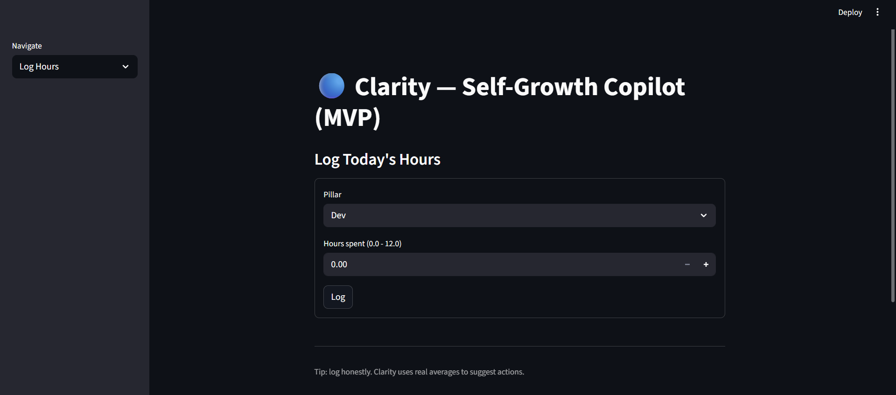
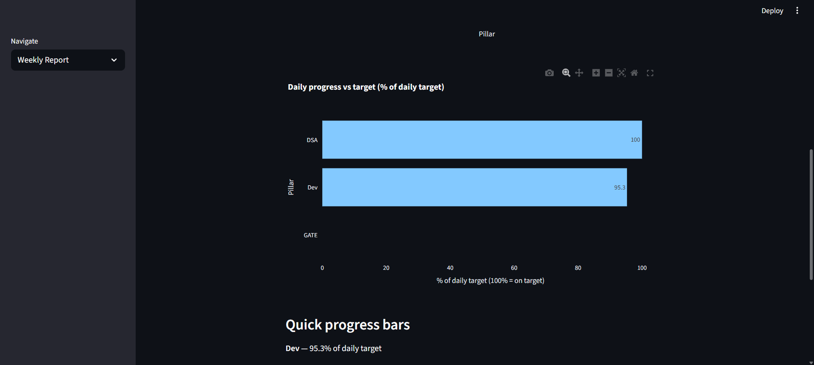
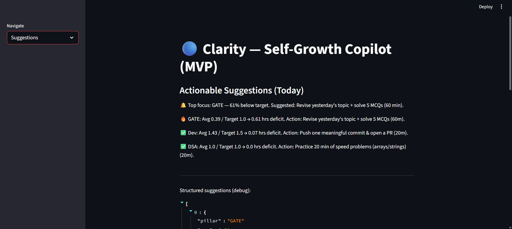
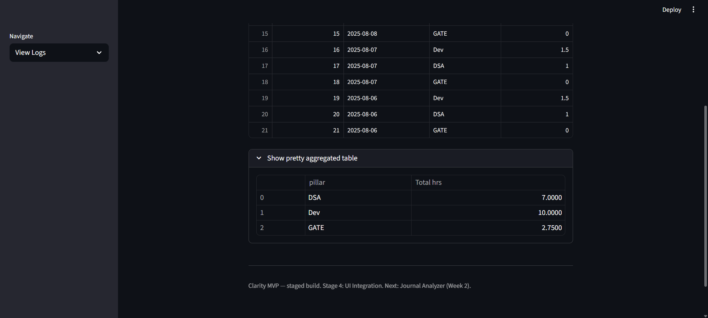

# CLARITY-MVP
---

# **Clarity – Your Self-Growth AI Copilot**

> **Know what matters. Do what matters.**
> Clarity is an AI-assisted personal dashboard that helps you track your growth, overcome perfection loops, stay aware of opportunities, and focus on what truly matters.

---

## **Problem Statement**

Many students and professionals struggle with:

1. **Perfection Paradox** – Over-consuming information and delaying execution.
2. **Awareness Gap** – Missing deadlines, events, and opportunities due to lack of timely updates.
3. **Scattered Tracking** – Goals, habits, and emotional well-being spread across multiple tools, making it hard to see the full picture.

**Clarity** solves this by acting as a **single intelligent hub** that tracks your progress, understands your mental patterns, and gives actionable, data-backed suggestions every day.

---

## **MVP Goal**

> Build a functional self-growth assistant in **4 weeks** that:

* Tracks and analyzes progress across **3 growth pillars** (Dev, DSA, GATE).
* Reads and interprets daily journals for **mood trends & recurring themes**.
* Detects **perfection loops** and alerts the user.
* Scrapes and displays relevant **ML/AI opportunities** with deadlines.
* Generates **one actionable suggestion** each day based on the user’s data.

---

## **Features**

* **Goal Tracker AI** – Log daily hours for your 3 growth pillars and get smart suggestions if you’re falling behind.
* **Journal Analyzer** – Analyze your daily journal for mood trends & recurring themes.
* **Perfection Loop Detector** – Detects over-research & lack of execution.
* **Opportunity Awareness Engine** – Stay updated on relevant events, internships, and contests.
* **Suggestions Hub** – One daily actionable focus point based on your data.

---

## **Tech Stack**

* **Frontend/UI**: [Streamlit](https://streamlit.io/)
* **Backend**: Python
* **Database**: SQLite / JSON
* **NLP**: NLTK, spaCy, HuggingFace (future)
* **Visualization**: Matplotlib / Plotly
* **Web Scraping**: BeautifulSoup4 (for opportunities module)

---

## **Project Structure**

```
/clarity
  /data        # Databases (logs, journals, opportunities)
  /scripts     # Python scripts for each module
  /ui          # Streamlit app files
  /docs        # Images, diagrams
README.md
requirements.txt
```

---

## **Getting Started**

---

````markdown
## Run Locally (Quickstart)

1. Clone and install:

git clone https://github.com/your-username/Clarity-MVP.git
cd Clarity-MVP
pip install -r requirements.txt
````

2. (Optional) Prepare deterministic test data:

```bash
python clarity/scripts/test_insert_fake_data.py
```

3. Run the app:

```bash
streamlit run clarity/ui/app.py
```

4. Open the Streamlit link in your browser (usually [http://localhost:8501](http://localhost:8501)).

   * **Log Hours** — Add today's hours for Dev / DSA / GATE.
   * **Weekly Report** — View averages, totals, and progress charts.
   * **Suggestions** — See the daily actionable suggestion.

---

## 📸 Screenshots (proof)

*These were captured on a local run of Clarity MVP.*

**Home Screen**


**Log Hours**



**Weekly Report — table + bar chart**


**Daily progress vs target & Quick bars**



**Actionable Suggestions**



**View Logs (raw entries)**





---

## **Roadmap**

* Week 1: Goal Tracker AI + UI + Suggestions
* Week 2: Journal Analyzer (NLP)
* Week 3: Perfection Loop Detector + Awareness Engine
* Week 4: Suggestions Hub + Deploy to Streamlit Cloud

---

## **License**

MIT License – feel free to fork & build your own Clarity.

---

## **Connect**

If you like this project, give it a ⭐ on GitHub and connect with me on [LinkedIn](#).


